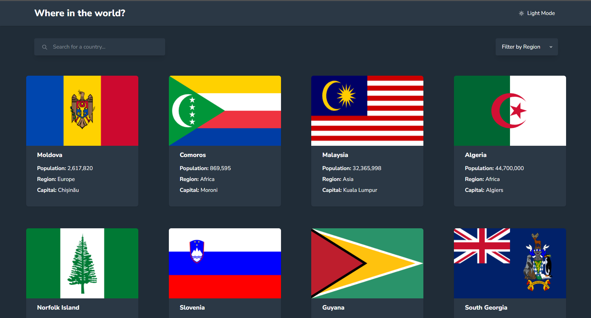

# Frontend Mentor - REST Countries API with Color Theme Switcher Solution

This is my solution to the [REST Countries API with Color Theme Switcher challenge on Frontend Mentor](https://www.frontendmentor.io/challenges/rest-countries-api-with-color-theme-switcher-5cacc469fec04111f7b848ca).  
It helped me strengthen my skills in React.js, Redux Toolkit, Tailwind CSS, and API integration by building a real-world, interactive web application.

---

## Table of Contents

- [Overview](#overview)
  - [The Challenge](#the-challenge)
  - [Screenshot](#screenshot)
  - [Links](#links)
- [My Process](#my-process)
  - [Built With](#built-with)
  - [What I Learned](#what-i-learned)
  - [Continued Development](#continued-development)
  - [Useful Resources](#useful-resources)
- [Author](#author)

---

## Overview

### The Challenge

Users should be able to:

- View all countries from the API on the homepage
- Search for a country using an input field
- Filter countries by region
- Click on a country to see detailed information on a separate page
- Click on border countries to navigate to their details
- Toggle the color scheme between light and dark mode (persisted with `localStorage`)
- Navigate through paginated results for better UX

---

### Screenshot



---

### Links

- Solution URL: [GitHub Repository](https://github.com/Devendra-singh-baghel/rest-country-api)
- Live Site URL: [Live Demo](https://rest-country-api-livid.vercel.app/)

---

## My Process

### Built With

- React.js – Component-based UI
- Redux Toolkit – State management for countries, details, and theme
- React Router – Client-side routing with dynamic parameters
- Tailwind CSS – Styling with dark/light mode support
- Axios – API requests to REST Countries API
- Mobile-first workflow – Fully responsive design
- JavaScript (ES6+) – Modern JS features

---
### What I Learned

- Fetching and filtering API data dynamically with Redux Toolkit async thunks
- Implementing pagination to efficiently display large datasets
- Managing dark/light theme with `localStorage` persistence
- Using Tailwind's `dark:` utilities for theming
- Handling API errors and loading states gracefully

Example: API fetching with region filtering

```js
export const fetchCountries = createAsyncThunk(
  'countries/fetchCountries',
  async ({ region, fields }) => {
    const url = region !== 'All'
      ? `https://restcountries.com/v3.1/region/${region}?fields=${fields}`
      : `https://restcountries.com/v3.1/all?fields=${fields}`;
    const response = await axios.get(url);
    return response.data;
  }
);
```

---

### Continued Development

Future improvements:

- Add search suggestions/autocomplete
- Integrate map view using Leaflet.js
- Write unit tests for components and slices

---

### Useful Resources

- [REST Countries API Documentation](https://restcountries.com/) – For retrieving country data
- [Redux Toolkit Documentation](https://redux-toolkit.js.org/) – For structured state management
- [Tailwind CSS Documentation](https://tailwindcss.com/) – For responsive styling

---

## Author

- GitHub: [@Devendra-singh-baghel](https://github.com/Devendra-singh-baghel)  
- Frontend Mentor: [@Devendra-singh-baghel](https://www.frontendmentor.io/profile/@Devendra-singh-baghel)  
- LinkedIn: [Devendra Singh Baghel](https://linkedin.com/in/devendra-singh-baghel-267023351)

